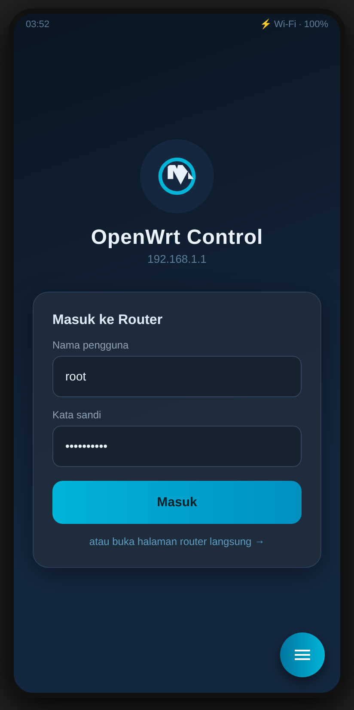
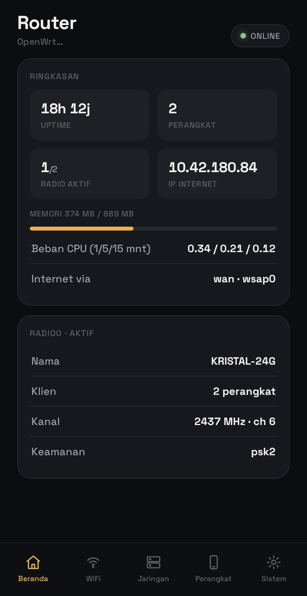
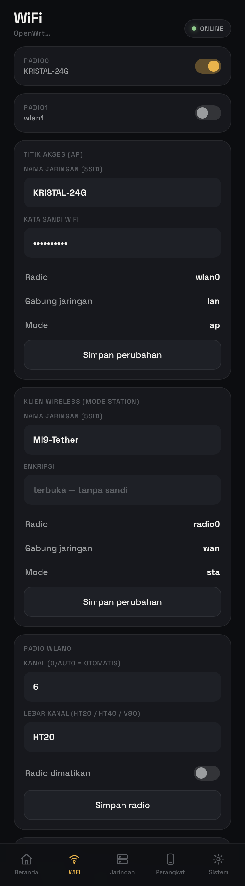
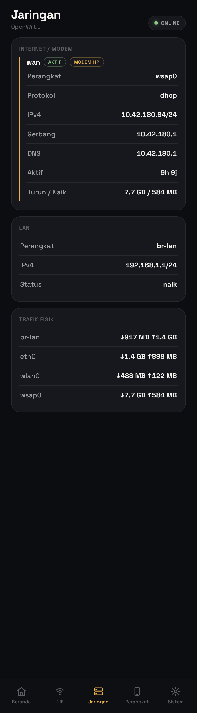
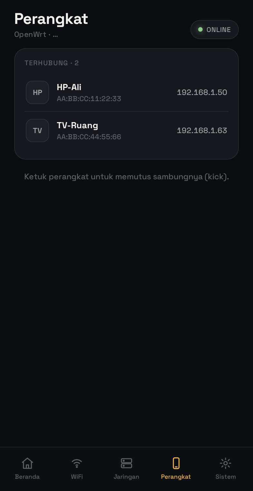

# 📱 OpenWrt Control

Aplikasi Android untuk mengakses halaman admin **OpenWrt / LuCI** (mis. STB B860H) langsung dari aplikasi — tanpa perlu buka browser dan ketik IP berulang kali.

Tampilannya aplikasi murni (bukan tab browser): header gelap custom, indikator koneksi real-time, dan semua fitur LuCI tetap lengkap.

## ✨ Fitur

- 🎨 **Desain "quiet luxury"** — hasil riset aturan anti-slop (taste-skill) + pola login kelas dunia: charcoal matte, satu aksen amber, Space Grotesk (font custom dibundel), bottom-sheet dengan drag handle, LED status berdenyut, hierarki tipografi presisi. Tanpa gradien ungu generik, tanpa emoji tempelan
- 📊 **Aplikasi penuh, bukan tempelan web** — setelah login masuk dashboard custom 5 tab yang bicara langsung ke router via RPC ubus + shell rpcd:
  - **Beranda** — uptime, jumlah perangkat, radio aktif, IP internet, memori + beban CPU, ringkasan tiap WiFi
  - **WiFi** — saklar radio on/off, **ganti nama (SSID) & kata sandi WiFi langsung dari aplikasi**, mode klien/station (repeater/tethering), kanal & lebar kanal per radio
  - **Jaringan** — semua antarmuka dengan IP/gateway/DNS/trafik, **deteksi modem HP (wsap/usb/tethering) dengan badge khusus**, trafik fisik per perangkat
  - **Perangkat** — daftar klien (nama/MAC/IP), **ketuk untuk menendang (kick) perangkat dari WiFi**
  - **Sistem** — info perangkat, **ping test dari router**, muat ulang WiFi, reboot, panel LuCI penuh
- ⚡ **Data live via RPC ubus/jsonrpc** — auto-refresh tiap 6 detik, dialog konfirmasi Android asli untuk aksi berbahaya
- 🔐 **Login sekali** — kredensial tersimpan, sesi RPC dipulihkan otomatis bila kedaluwarsa
- 🧭 **Panel LuCI lengkap tetap tersedia** dari tab Sistem untuk setting lanjutan

## 📸 Pratinjau Tampilan

| Login | Beranda | WiFi | Jaringan | Perangkat |
|---|---|---|---|---|
|  |  |  |  |  |

> Render 1:1 dari aset aplikasi sungguhan dengan data contoh (mock) — di HP, angka terisi dari router aslimu via RPC.

## 📥 Cara Install

1. Unduh `OpenWrt-Control-v1.0.apk` di halaman **[Releases](../../releases)**
2. Pindahkan ke HP, lalu buka (tap) file-nya
3. Jika muncul peringatan, izinkan instalasi dari *sumber tidak dikenal*
4. Sambungkan HP ke **Wi-Fi dari router/STB OpenWrt Anda**
5. Buka aplikasi — langsung menampilkan halaman LuCI

Alamat router default `http://192.168.1.1`. Beda IP? Tap **☰ Menu → Ganti Alamat Router**.

## 🛠️ Build dari Source

```bash
cd android
./gradlew assembleDebug
# hasil: android/app/build/outputs/apk/debug/app-debug.apk
```

Butuh JDK 17 + Android SDK (platform 34). Atau biarkan **GitHub Actions** yang build: setiap push ke `master` otomatis menghasilkan artifact APK di tab Actions.

## 📄 Spesifikasi Teknis

| | |
|---|---|
| Package | `com.openwrt.luci` |
| Min / Target SDK | Android 5.0 (API 21) / Android 14 (API 34) |
| Dependensi | **Nol** — murni framework Android (WebView) |
| Ukuran APK | ±20 KB (debug) |
| Izin | INTERNET, ACCESS_NETWORK_STATE, ACCESS_WIFI_STATE |

## ⚠️ Catatan Keamanan

- Aplikasi memakai `usesCleartextTraffic` karena LuCI umumnya berjalan di HTTP lokal — hanya relevan di jaringan LAN Anda.
- Sertifikat self-signed HTTPS router diterima otomatis (dialog SSL di-bypass) — sesuai pemakaian lokal.
- Tidak ada data yang dikirim ke luar; aplikasi hanya bicara dengan router di jaringan yang sama.
