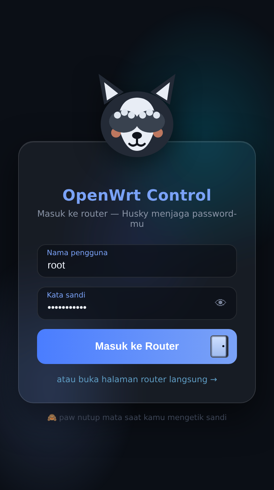
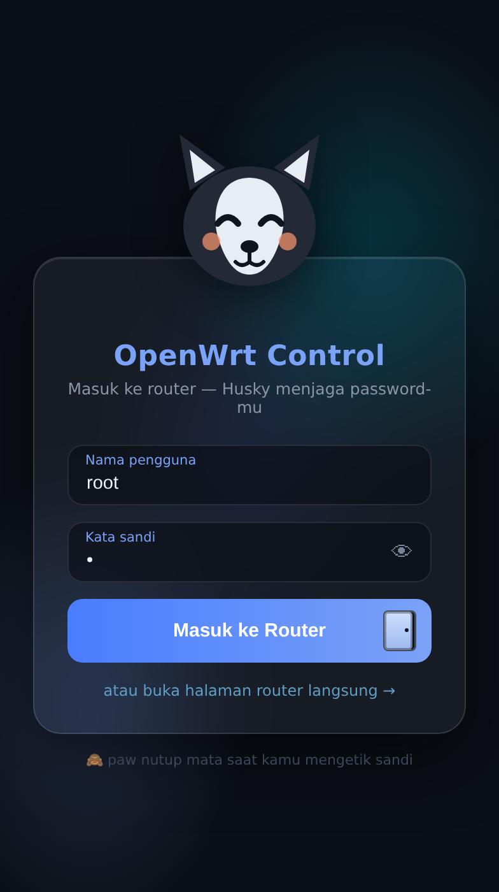
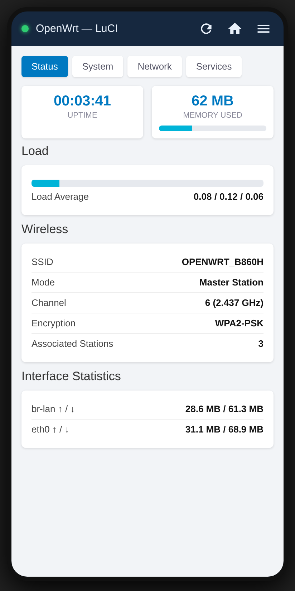

# 📱 OpenWrt Control

Aplikasi Android untuk mengakses halaman admin **OpenWrt / LuCI** (mis. STB B860H) langsung dari aplikasi — tanpa perlu buka browser dan ketik IP berulang kali.

Tampilannya aplikasi murni (bukan tab browser): header gelap custom, indikator koneksi real-time, dan semua fitur LuCI tetap lengkap.

## ✨ Fitur

- 🐺 **Login "Husky Guard"** — layar pembuka custom penuh animasi: husky kartun menutup mata dengan paw saat kamu mengetik sandi, mata melirik mengikuti sentuhan, paw mengintip saat ikon 👁 ditekan, dan senang saat login berhasil; kredensial disimpan lalu form login LuCI diisi & dikirim otomatis
- 🚪 **Tombol Masuk dengan pintu** — animasi pintu terbuka + stickman berjalan masuk saat submit (ala video referensi)
- 📱 **Fullscreen tanpa bar** — tidak ada status bar, tidak ada header/loading bar ala browser; kontrol hanya FAB ☰ cyan di pojok
- 🧊 Kaca *glassmorphism* + glow teal-biru, latar gelap, tanpa kedip putih
- 🧭 **Semua menu LuCI utuh** — WebView penuh: JavaScript, cookies, zoom, back HP = kembali halaman
- 🔄 **Menu cepat (FAB)** — Muat Ulang / Beranda / Halaman Login / Ganti Alamat Router / Logout
- 🌐 **Ganti alamat router dari dalam aplikasi** — tidak terpaku di `192.168.1.1`

## 📸 Pratinjau Tampilan

| Idle — mata terbuka | 🙈 Mengetik sandi — paw menutup mata | ✅ Login berhasil — husky senang |
|---|---|---|
|  |  |  |

Setelah login, halaman LuCI tampil **fullscreen tanpa bar apa pun** — hanya tombol ☰ mengambang:



> Gambar adalah render 1:1 dari HTML/aset yang benar-benar dipakai aplikasi (bukan emulator).

## 📥 Cara Install

1. Unduh `OpenWrt-Control-v1.0.apk` di halaman **[Releases](../../releases)**
2. Pindahkan ke HP, lalu buka (tap) file-nya
3. Jika muncul peringatan, izinkan instalasi dari *sumber tidak dikenal*
4. Sambungkan HP ke **Wi-Fi dari router/STB OpenWrt Anda**
5. Buka aplikasi — langsung menampilkan halaman LuCI

Alamat router default `http://192.168.1.1`. Beda IP? Tap **☰ Menu → Ganti Alamat Router**.

## 🛠️ Build dari Source

```bash
cd android
./gradlew assembleDebug
# hasil: android/app/build/outputs/apk/debug/app-debug.apk
```

Butuh JDK 17 + Android SDK (platform 34). Atau biarkan **GitHub Actions** yang build: setiap push ke `master` otomatis menghasilkan artifact APK di tab Actions.

## 📄 Spesifikasi Teknis

| | |
|---|---|
| Package | `com.openwrt.luci` |
| Min / Target SDK | Android 5.0 (API 21) / Android 14 (API 34) |
| Dependensi | **Nol** — murni framework Android (WebView) |
| Ukuran APK | ±20 KB (debug) |
| Izin | INTERNET, ACCESS_NETWORK_STATE, ACCESS_WIFI_STATE |

## ⚠️ Catatan Keamanan

- Aplikasi memakai `usesCleartextTraffic` karena LuCI umumnya berjalan di HTTP lokal — hanya relevan di jaringan LAN Anda.
- Sertifikat self-signed HTTPS router diterima otomatis (dialog SSL di-bypass) — sesuai pemakaian lokal.
- Tidak ada data yang dikirim ke luar; aplikasi hanya bicara dengan router di jaringan yang sama.
